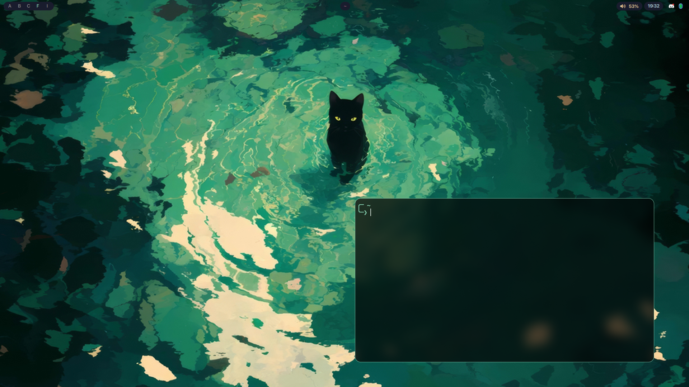
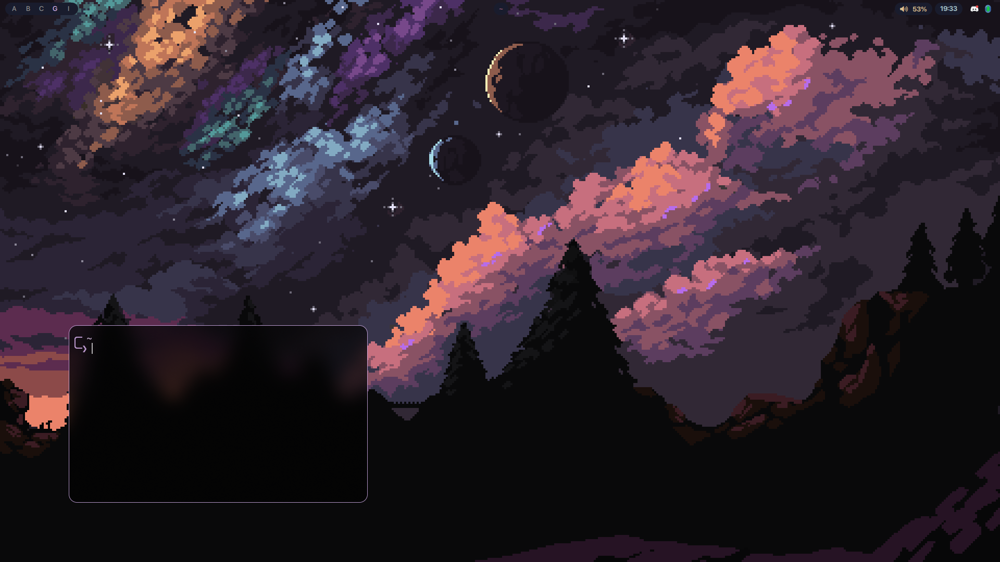

# Dotfiles
Welcome to my dotfiles!

Read below what its about  
▪ Nice looking while staying usable  
▪ Not recommended for beginners  

# Installation

Run the following commands to install!
```shell
sudo pacman -S git
git clone https://github.com/zaaaappp/dots2.git
cd dots2
./install.sh
```
* script is untested


# Configuration
These dotfiles are configured for NVidia by default.

If you're on an AMD gpu, Remove the NVidia lines in hyprland.conf  
Adjust the monitor section to your [monitors](https://wiki.hypr.land/Configuring/Monitors/)  

# Keybinds
Super + shift + C = Color picker  
Super + shift + S = Screenshot  
Super + shift + D = Wallpaper + theme picker ( drag wallpapers into ~/Pictures/wallpapers/ )  
Super + D (or maybe Super + space one of them idk if i updated the github) = App picker  
Super + enter = Open terminal  
Super + e = File explorer  
Super + q = Close app  
Super + shift + q = Force close app  
Super + letter (1-0) = Move to workspace letter  
Super + ctrl + letter (1-0) = Move active window to workspace letter but DONT switch to that workspace  
Super + shift + letter (1-0=) = Move active window to workspace letter and switch to that workspace  

(not full list)

# Pictures





Special credits to [JaKooLit](https://github.com/JaKooLit/Hyprland-Dots) for most of the files.  
Heavily inspired by [saneAspect](https://www.youtube.com/@saneAspect) on YouTube
